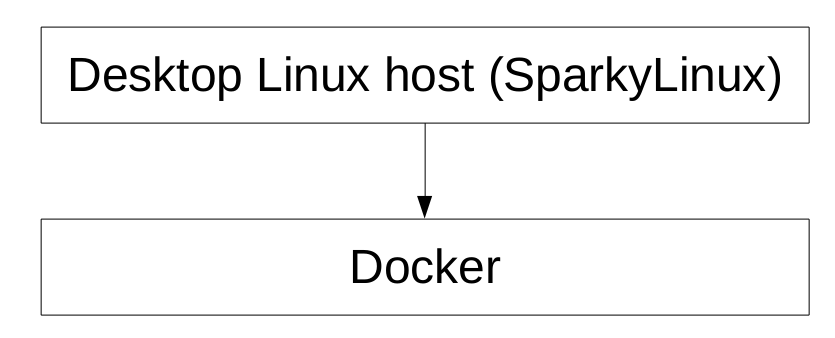
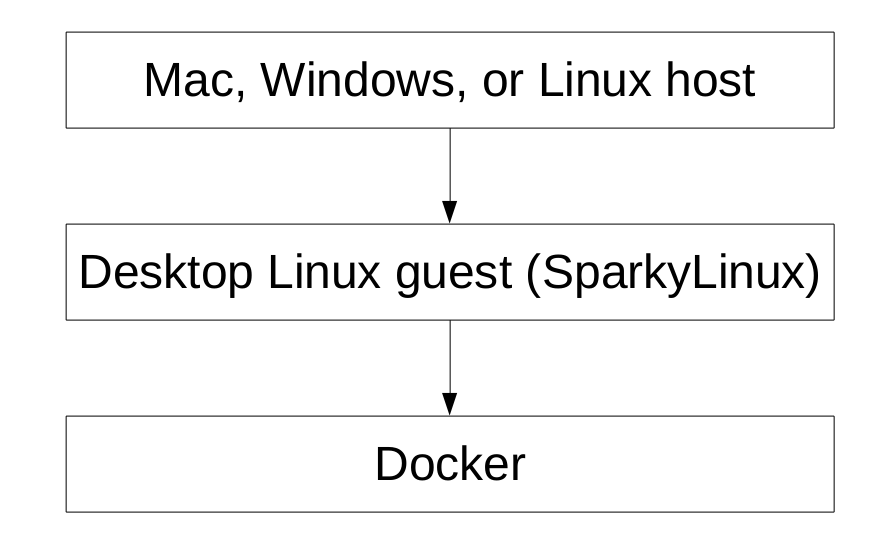

# Docker Tutorial - Debian Stretch

Welcome to the Docker Tutorial of [Ruby on Racetracks](http://www.rubyonracetracks.com/)!  This is the tutorial for the Ruby on Racetracks way of getting started in Docker.  Please note that I am using Docker as a replacement for Vagrant.  Instead of having a different Docker container for each capability (such as one for PostgreSQL, one for Rails, etc.), I prefer to have all the software I need pre-installed and pre-configured in the Docker image.

## Prerequisites
* You should have version 4 of SparkyLinux installed as your host OS or virtual OS.  You may also use any other Linux distro based on Debian Stretch.
* If you are using a Mac or Windows, you can use a VirtualBox virtual machine with SparkyLinux on it.  For more details, go through my [VirtualBox Tutorial](https://github.com/jhsu802701/tutorial_virtualbox).

## FAQ
Go to http://www.rubyonracetracks.com/faq-docker.html .

## Layers
* The preferred setup is SparkyLinux (or something similar) as your host system.  Docker runs within SparkyLinux.  Because Docker is a virtual environment, Ruby on Rails will be within a virtual environment.
* If you must use MacOS or Windows as your host system, you should be use VirtualBox to create a SparkyLinux guest system.  Docker runs within SparkyLinux.  Ruby on Rails will be in a virtual environment within a virtual machine.

## Block Diagram
* The preferred setup:

* The VirtualBox setup:

